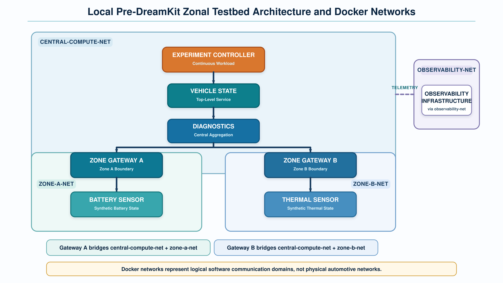
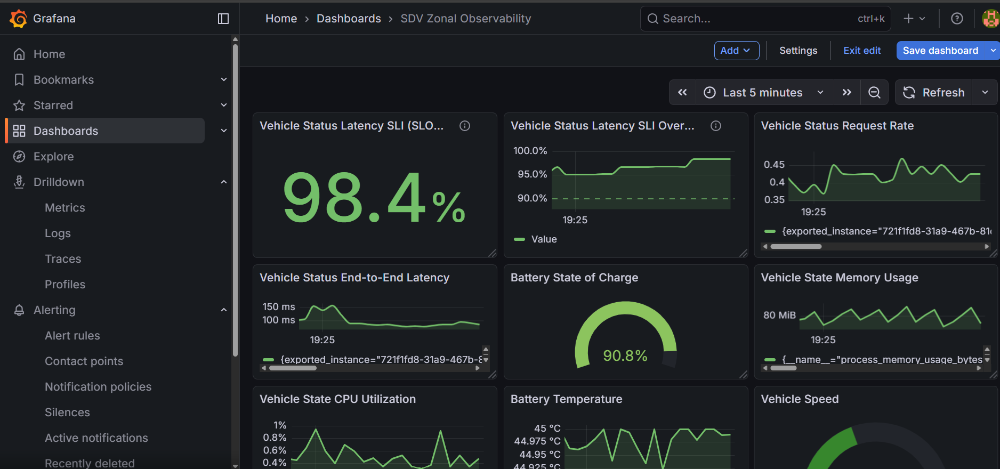
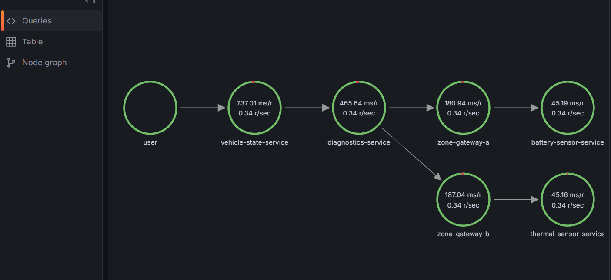

# SDV Zonal Observability Testbed

A containerized miniature Software-Defined Vehicle (SDV) testbed for hands-on experimentation with distributed service communication, multimodal observability, runtime dependency reconstruction, Service-Level Indicator (SLI) / Service-Level Objective (SLO) monitoring, alerting, and controlled service degradation.

The environment uses Docker, OpenTelemetry, Prometheus, Grafana Tempo, Grafana Loki, and Grafana.

> **Scope:** This is a local pre-DreamKit learning and observability testbed. It is not intended to reproduce the hardware, communication timing, physical behaviour, or complete software architecture of a production SDV or DreamKit.

---

## 1. Testbed at a Glance

The testbed implements a simplified zonal SDV architecture on a single development computer. Central software functions communicate through two logical zonal paths, while a continuous synthetic workload exercises the complete distributed request path.

The project demonstrates:

- containerized distributed software components representing selected SDV roles;
- logical central and zonal communication domains;
- OpenTelemetry metrics, logs, and distributed traces;
- Prometheus, Tempo, and Loki observability backends;
- a live Grafana operational dashboard;
- runtime Service Graph reconstruction;
- Vehicle Status latency SLI/SLO monitoring;
- Grafana alerting and external webhook notification; and
- controlled latency degradation and recovery.

### Miniature Zonal Testbed Architecture



The figure shows the logical architecture implemented for the local testbed. Vehicle State and Diagnostics represent central software/service roles, while Zone Gateway A and Zone Gateway B are software representations of zonal gateway roles. The Battery Sensor and Thermal Sensor similarly provide software simulations of vehicle-facing end nodes.

All of these components are implemented as Python/FastAPI services so that the complete distributed path can execute on one development computer. This is an implementation abstraction rather than a claim about how physical gateways, zone controllers, ECUs, or sensors are implemented in a production SDV.

### Grafana Observability Dashboard



The final Grafana dashboard provides a unified operational view of synthetic vehicle state, software-resource behaviour, continuous workload, end-to-end service performance, and Vehicle Status latency SLI/SLO monitoring.

### Runtime Service Dependencies



The Runtime Service Graph is reconstructed from observed distributed trace relationships. It exposes the executed dependency path from Vehicle State through Diagnostics and the two logical zonal branches. It represents observed runtime communication dependencies and should not be interpreted as a causal graph.

---

## 2. Testbed Architecture and Component Roles

The distributed testbed path is:

```text
Continuous Synthetic Workload
          |
          v
    Vehicle State
          |
          v
     Diagnostics
       /       \
      v         v
Gateway A     Gateway B
    |             |
    v             v
Battery        Thermal
Sensor         Sensor
```

Diagnostics requests information from the two zonal branches concurrently.

### Testbed software components and represented SDV roles

| Testbed component | Represented role |
|---|---|
| Vehicle State | Central software/application service |
| Diagnostics | Central diagnostic software/service |
| Zone Gateway A | Software representation of a Zone A gateway role |
| Zone Gateway B | Software representation of a Zone B gateway role |
| Battery Sensor | Software simulation of a Zone A vehicle-facing sensor/end node |
| Thermal Sensor | Software simulation of a Zone B vehicle-facing sensor/end node |

> **Important:** The six components above are implemented as Python/FastAPI services for the purpose of creating an executable distributed demonstration on one development computer. Their implementation technology should not be confused with the physical or logical implementation of corresponding roles in a real SDV.

The `experiment-controller` is separate from these six testbed components. It generates the continuous synthetic workload by requesting the Vehicle Status endpoint approximately once every two seconds.

---

## 3. Technology Stack

### Application

- Python
- FastAPI
- Uvicorn
- HTTPX / Requests
- HTTP/JSON service communication

### Containerization

- Docker
- Docker Compose
- Docker bridge networks

### Observability

- OpenTelemetry
- OpenTelemetry Collector
- Prometheus
- Grafana Tempo
- Grafana Loki
- Grafana

---

## 4. Containerized Deployment

The complete environment contains 12 containers:

```text
6  Application services
1  Experiment Controller
1  OpenTelemetry Collector
1  Tempo
1  Prometheus
1  Loki
1  Grafana
-----------------------------
12 containers
```

Docker Compose defines and manages the environment through `compose.yaml`.

The locally developed application services and Experiment Controller are built from local Dockerfiles. Published container images are used for the observability infrastructure.

---

## 5. Docker Network Architecture

Four logical Docker bridge networks are used:

```text
central-compute-net
zone-a-net
zone-b-net
observability-net
```

`central-compute-net` connects the Experiment Controller, Vehicle State, Diagnostics, and the central-facing interfaces of both gateways.

Zone Gateway A belongs to both:

```text
central-compute-net
zone-a-net
```

Zone Gateway B belongs to both:

```text
central-compute-net
zone-b-net
```

The Battery Sensor belongs to Zone A and the Thermal Sensor belongs to Zone B.

The observability infrastructure uses `observability-net`, while the OpenTelemetry Collector is positioned so that it can receive telemetry from the distributed application and communicate with the observability components.

Containers use Docker Compose service names for internal communication. For example:

```text
http://diagnostics:8010/diagnostics/check
```

Inside a container, `localhost` refers to that container itself and should not be used to address another container.

> The Docker networks represent logical software communication domains. They do not emulate physical automotive Ethernet, CAN, or CAN-FD networks.

---

## 6. OpenTelemetry Observability Pipeline

All six testbed software components use OpenTelemetry instrumentation.

Each service defines a distinct `service.name`, allowing its telemetry to be identified consistently across metrics, logs, and traces.

The primary telemetry flow is:

```text
Instrumented Application Services
              |
              | OTLP/gRPC
              v
     OpenTelemetry Collector
          /      |      \
         v       v       v
      Tempo  Prometheus  Loki
      Traces   Metrics   Logs
          \      |      /
                 v
              Grafana
```

### Metrics

The application exports custom and automatically instrumented measurements including:

- request counts;
- request durations;
- error counts;
- synthetic vehicle-state measurements;
- process/runtime measurements; and
- selected system-resource measurements.

Counters, gauges, and histograms are used according to the meaning of each measurement.

### Distributed traces

FastAPI and HTTP-client instrumentation propagate trace context across the service path, allowing a Vehicle Status request to be reconstructed across the distributed application.

### Centralized logs

Application log records are exported through OpenTelemetry and stored centrally in Loki for investigation through Grafana.

---

## 7. Runtime Service Graph

Tempo is configured with its metrics generator to derive runtime information from distributed traces.

The enabled processors include:

```yaml
service-graphs
span-metrics
local-blocks
```

Generated metrics are remote-written to Prometheus.

Prometheus is therefore started with:

```text
--web.enable-remote-write-receiver
```

This enables Grafana to visualize a runtime Service Graph derived from observed trace relationships.

The resulting graph reproduces the implemented service topology:

```text
vehicle-state-service
        |
        v
diagnostics-service
     /             \
    v               v
zone-gateway-a   zone-gateway-b
      |                |
      v                v
battery-sensor     thermal-sensor
```

The Service Graph represents observed runtime dependencies. It should not be interpreted as a causal graph.

---

## 8. Grafana Dashboard

The final `SDV Zonal Observability` dashboard contains 10 panels.

The original operational panels monitor:

1. Vehicle Speed
2. Battery State of Charge
3. Battery Temperature
4. Thermal Sensor Temperature
5. Vehicle State CPU Utilization
6. Vehicle State Memory Usage
7. Vehicle Status End-to-End Latency
8. Vehicle Status Request Rate

Two additional panels provide SLI/SLO monitoring:

9. Current Vehicle Status Latency SLI
10. Vehicle Status Latency SLI Over Time

The dashboard therefore combines synthetic vehicle state, resource behaviour, workload, application performance, and service-quality monitoring.

### Dashboard export

The final dashboard definition is stored in:

```text
observability/grafana/dashboards/sdv-zonal-observability.json
```

It can be imported into Grafana if the dashboard is not already available through an existing persistent Grafana volume.

---

## 9. Vehicle Status Latency SLI and SLO

A Vehicle Status request is classified as **good** when:

```text
Vehicle Status latency <= 350 ms
```

The Vehicle Status duration histogram contains an explicit `350 ms` boundary so that Prometheus can directly count requests satisfying this criterion.

The rolling five-minute SLI is conceptually:

```text
SLI =
100 *
(number of Vehicle Status requests <= 350 ms during the last 5 minutes)
/
(total Vehicle Status requests during the last 5 minutes)
```

The Prometheus expression is:

```promql
100 *
sum(
  increase(
    vehicle_status_duration_milliseconds_bucket{le="350.0"}[5m]
  )
)
/
sum(
  increase(
    vehicle_status_duration_milliseconds_count[5m]
  )
)
```

The experimental SLO is:

```text
SLI >= 90%
```

Therefore:

```text
350 ms = good-request latency criterion
5 min  = rolling SLI window
90%    = experimental SLO
```

These are **demonstration parameters for the local testbed**, not production SDV timing or reliability requirements.

---

## 10. Grafana Alerting

The repository includes the exported Grafana alert rule:

```text
observability/grafana/alerting/vehicle-status-latency-slo.yaml
```

The rule is named:

```text
Vehicle Status Latency SLO Violation
```

It evaluates whether:

```text
Vehicle Status latency SLI < 90%
```

The rule is evaluated every minute and uses a two-minute pending period.

The simplified lifecycle is:

```text
Normal
  |
  v
Pending
  |
  v
Firing
  |
  v
Resolved
```

Representative labels include:

```text
service  = vehicle-state
severity = warning
slo      = vehicle-status-latency
```

### External notification

The development environment used a Grafana contact point named:

```text
SDV SLO Webhook
```

The exported alert rule references this receiver name but **does not contain the external webhook URL**.

To reproduce external notification, create an appropriate Grafana contact point named `SDV SLO Webhook`, or modify the rule to use another contact point.

Webhook.site was used during development only to validate that firing and resolved notifications could leave Grafana successfully. No Webhook.site URL is stored in this repository.

---

## 11. Controlled Gateway A Latency Experiment

Zone Gateway A supports a controlled artificial latency intervention through:

```text
GATEWAY_A_DELAY_MS
```

The healthy default in `compose.yaml` is:

```yaml
GATEWAY_A_DELAY_MS: "0"
```

This means no artificial delay is introduced during normal operation.

For the controlled degradation experiment, the value can be changed to:

```yaml
GATEWAY_A_DELAY_MS: "500"
```

After changing the value, recreate the affected service:

```bash
docker compose up -d --force-recreate zone-gateway-a
```

The expected experimental propagation is:

```text
500-ms Gateway A intervention
          |
          v
Gateway A latency increases
          |
          v
Diagnostics waits longer
          |
          v
Vehicle Status latency increases
          |
          v
Rolling SLI decreases
          |
          v
SLI < 90%
          |
          v
Pending -> Firing
          |
          v
External notification
```

During the validated experiment, the artificial 500-ms delay produced an average Gateway A request duration of approximately 519 ms and contributed to a Vehicle Status SLO violation.

### Recovery

Restore:

```yaml
GATEWAY_A_DELAY_MS: "0"
```

and recreate Gateway A:

```bash
docker compose up -d --force-recreate zone-gateway-a
```

Because the SLI uses a rolling five-minute window, recovery is not instantaneous. Earlier slow requests remain in the calculation until they leave the active window.

The validated lifecycle was:

```text
Healthy
-> Controlled Intervention
-> Degradation
-> SLO Violation
-> Firing Alert
-> External Notification
-> Intervention Removed
-> Recovery
-> Resolved Notification
```

> The controlled intervention validates observability, fault propagation, alerting, and recovery. It is not an implementation of automatic causal RCA.

---

## 12. Running the Testbed

### Prerequisites

- Docker Desktop
- Docker Compose

From the project root:

```bash
docker compose config
```

Build and start the complete environment:

```bash
docker compose up -d --build
```

Check container status:

```bash
docker compose ps
```

### Access the Running Testbed

Once the containers are running, the top-level Vehicle Status endpoint is available at:

[http://localhost:8000/vehicle/status](http://localhost:8000/vehicle/status)

Opening this endpoint returns the aggregated Vehicle Status response produced through the distributed testbed path.

The Vehicle State FastAPI interactive API documentation is available at:

[http://localhost:8000/docs](http://localhost:8000/docs)

Grafana is available at:

[http://localhost:3000](http://localhost:3000)

From Grafana, the testbed can be investigated through:

- the **SDV Zonal Observability** dashboard;
- **Explore** for direct Prometheus, Tempo, and Loki queries;
- **Drilldown → Metrics** for metric exploration;
- **Drilldown → Traces** for distributed tracing;
- **Service structure** for the runtime Service Graph; and
- **Alerting** for the Vehicle Status latency SLO rule.

The Experiment Controller continuously generates Vehicle Status requests, so the observability environment begins receiving fresh activity automatically after the containers start.

> **Note:** `localhost` refers to the computer on which the testbed is running. These links become available only after the corresponding Docker containers have been started. Port `3000` is commonly used by local Grafana installations, so another local project using Grafana may use the same URL when that project is running instead.

### Useful Runtime Commands

Follow the continuous workload:

```bash
docker compose logs -f experiment-controller
```

Inspect recent logs from an individual service:

```bash
docker compose logs --tail 20 <service-name>
```

Stop the environment:

```bash
docker compose down
```

After a normal computer or Docker Desktop restart, existing containers can usually be restarted without rebuilding:

```bash
docker compose up -d
```

---

## 13. Project Structure

```text
sdv-zonal-observability/
|
|-- compose.yaml
|-- README.md
|-- .gitignore
|
|-- services/
|   |-- vehicle-state/
|   |-- diagnostics/
|   |-- zone-gateway-a/
|   |-- zone-gateway-b/
|   |-- battery-sensor/
|   `-- thermal-sensor/
|
|-- experiment-controller/
|   |-- controller.py
|   |-- requirements.txt
|   `-- Dockerfile
|
`-- observability/
    |-- otel-collector-config.yaml
    |-- prometheus.yml
    |-- tempo.yaml
    |-- loki.yaml
    |
    `-- grafana/
        |-- dashboards/
        |   `-- sdv-zonal-observability.json
        |
        `-- alerting/
            `-- vehicle-status-latency-slo.yaml
```

---

## 14. Validation

The completed testbed has been validated across the full observability workflow:

- all 12 expected containers run under Docker Compose;
- the Experiment Controller continuously exercises the distributed service path;
- the 10-panel Grafana dashboard receives current telemetry;
- Prometheus stores application and resource metrics;
- Tempo captures distributed traces across the six application services;
- Loki receives centralized application logs;
- the runtime Service Graph reconstructs the implemented service dependencies;
- the 350-ms histogram boundary supports the rolling latency SLI;
- the experimental 90% SLO is evaluated by Grafana Alerting;
- a controlled 500-ms Gateway A intervention produces observable end-to-end degradation;
- the alert transitions to firing after a persistent violation;
- external webhook notification has been validated; and
- removal of the intervention produces recovery and a resolved notification.

---

## 15. Scope and Limitations

This testbed is intentionally simplified.

All application and observability components execute on a single general-purpose development computer through Docker Desktop. They therefore share resources with one another, the host operating system, and other applications.

Observed latency can consequently vary with host workload and scheduling. The `350 ms` good-request boundary and `90%` SLO are demonstration parameters rather than production vehicle requirements.

The six FastAPI services are software abstractions. Zone Gateway A and Zone Gateway B are not physical automotive zone controllers, while the Battery Sensor and Thermal Sensor are software simulators rather than physical sensors or ECUs.

Docker bridge networks provide logical communication segmentation but do not reproduce:

- automotive Ethernet timing;
- CAN or CAN-FD bus behaviour;
- bus arbitration;
- physical gateway behaviour;
- real sensor timing; or
- vehicle-network fault modes.

The project currently provides the observability and controlled-experiment foundation required for later causal RCA work. It does not perform causal discovery, causal-effect estimation, or automatic root-cause ranking.

---

## 16. Transition to DreamKit

The next research stage is to characterize the actual DreamKit configuration before transferring the methodology.

The characterization will determine:

- available vehicle-compute resources;
- deployable and modifiable services;
- gateway and zone-level architecture;
- vehicle-data interfaces;
- Ethernet, CAN, CAN-FD, or other communication access;
- available metrics, logs, and traces;
- process-, container-, and compute-level resource measurements;
- resource-allocation and isolation controls;
- timestamp synchronization;
- controllable fault mechanisms; and
- operational and safety restrictions.

The objective is to transfer the **observability methodology, experimental reasoning, and technical understanding**, not the implementation assumptions of this laptop-based testbed.

The local pre-DreamKit environment is considered complete and provides the practical foundation for subsequent context-conditioned causal RCA experiments on a more realistic SDV platform.